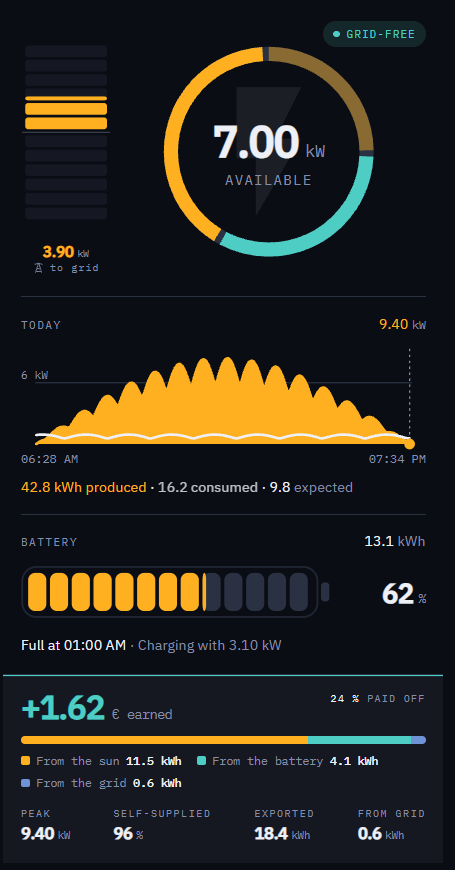

# Power Origin

A Lovelace card that answers the two questions a solar house actually raises: **where is my electricity coming from right now**, and **how much is spare**.



Four blocks, each optional and each switched on by the entities you give it:

- **Ring and column** — the ring splits a total into its parts; the column beside it is a meter with a middle, surplus climbing and grid draw sinking. Set a threshold and the column stays held back until there is enough spare to be worth acting on.
- **Day chart** — production as an area or hourly bars, consumption as a line, on the solar day's axis. Where the line sits above the area, the grid or the battery filled the gap.
- **Battery** — segments, a solid bar or a bare bar, coloured by state, with a remaining time averaged over half an hour rather than taken from the instant.
- **Today** — the money balance, where the day's energy came from, and any four of peak, self-supplied share, exported, imported, produced, expected and paid off.

Everything is configurable from the visual editor. **None of it needs YAML.**

---

## Install

### HACS

Add this repository as a custom repository of type **Dashboard**, then install *Power Origin*.

### Manual

Copy `power-origin-card.js` from the latest release into `config/www/community/power-origin-card/` and add the resource:

```yaml
url: /local/community/power-origin-card/power-origin-card.js
type: module
```

---

## Minimal configuration

Only the house consumption sensor is required. Every other entity switches on the part of the card that needs it.

```yaml
type: custom:power-origin-card
entities:
  house: sensor.house_consumption
```

Nothing is invented for a sensor you have not given. No battery entities means no battery block and no green anywhere; an unreachable inverter says so rather than drawing a zero.

---

## The four ring modes

| Mode | The number in the middle | The ring | Answers |
| --- | --- | --- | --- |
| `power` | house load | where it comes from | What is the house running on? |
| `production` | what the roof makes | where it goes | What is the system doing? |
| `surplus` | spare power | the roof's output, spare highlighted | Can I switch something on? |
| `autarky` | self-supplied share | where it comes from | How independent am I right now? |

`production` and `surplus` fall back to `power` before sunrise: a ring about production has nothing to say when nothing is produced.

### The ring has a type too

| `ring.rings` | |
| --- | --- |
| `single` *(default)* | one ring: the shares right now |
| `double` | a second, thinner ring outside, carrying **the same question over the whole day** |
| `clock` | the whole circle is the day: position is the hour, colour is the source that carried it |

The outer ring follows the question the centre asks. For `power` and `autarky` that is the day the house was supplied from; for `production` and `surplus` it is the roof's day, with the energy still expected drawn faintly on the end of it.

This is not the outer ring an earlier version had, where blue meant *from the grid* inside and *to the grid* outside. Here the same colour always means the same thing, and only the window differs.

`ring.inner` decides what sits behind the centre figure: a symbol for the mode, the day's consumption curve, or nothing at all.


Evening, the same card: the house runs entirely on the battery, the grid is untouched, and the battery reckons how comfortably it reaches sunrise rather than quoting an hour the sun will make nonsense of.

---

## The column has a type

| `ring.meter_style` | What the column is |
| --- | --- |
| `blocks` *(default)* | a stepped needle: up is surplus, down is draw |
| `bar` | the same reading as one continuous body |
| `day` | the day itself: 24 bands, one per hour, coloured by the source that carried it |
| `balance` | two columns on one scale, the roof beside the house |

`day` and `balance` are the two that are never empty. A needle reads zero all night; the day strip still shows the day, and the two columns still show that the roof is off while the house draws.

**`balance` answers what no ring can.** A ring shows what a total is made of, never whether the total is enough. Taller roof means spare, taller house means bought in, and the label names the difference, which is the part anyone acts on. Both columns share one scale, because two bars on separate scales compare nothing.

### What a needle measures

For `blocks` and `bar`, one setting decides which boundary it watches:

| `ring.meter_scope` | Up | Down |
| --- | --- | --- |
| `grid` *(default)* | export | import |
| `all` | export and battery charging | import and battery discharge |

`grid` keeps the column on the billing meter, so the ring can name the battery without the two saying the same thing twice. Below fifty watts the column prints no figure at all and says *no grid exchange* — a hundredth of a kilowatt is the meter breathing, not a flow worth a decision.

Its scale is **absolute, not weather-following**: three kilowatts down and the system's yearly peak up, both overridable. A meter scaled to a dull day would show 900 W as nearly full, and 900 W does not run a dishwasher.

---

## What the battery says

| State | Caption |
| --- | --- |
| Empties before sunrise | **Lasts until 03:15** · 1.2 kWh left |
| Only just gets through | **Only just reaches sunrise** |
| Gets through | **Lasts until sunrise** |
| Gets through with room to spare | **Well past sunrise** |
| Down to the reserve | **At the reserve** |
| Load still jumping | *(nothing)* |

The distinction matters: knowing whether you have to save power tonight or can afford to spend it is the whole point of the line. The remaining time divides by the **averaged** house load, not the instantaneous one — switch on a kettle and an instantaneous estimate drops from eleven hours to forty minutes.

---

## Full configuration

```yaml
type: custom:power-origin-card
title: Solar                     # left empty the card shows no heading
text_scale: 1                    # 1.2 or so for a tablet on a wall
chip: always                     # always | gridfree | never
battery_capacity: 13100          # usable capacity in Wh
battery_reserve: 0               # percent never delivered
battery_invert: false            # true if positive means charging
grid_invert: false               # true if positive means export

entities:
  house: sensor.house_consumption          # the only required entity
  solar: sensor.pv_power
  battery_power: sensor.battery_power
  battery_soc: sensor.battery_state_of_charge
  grid_power: sensor.grid_power
  solar_today: sensor.solar_energy_today
  house_today: sensor.house_energy_today
  export_today: sensor.export_energy_today
  import_today: sensor.import_energy_today
  battery_out_today: sensor.battery_discharge_today
  forecast: sensor.solcast_forecast_remaining_today
  cost_today: sensor.energy_balance_today
  cost_export_today: sensor.export_revenue_today
  cost_import_today: sensor.import_cost_today
  price_import: input_number.electricity_price
  price_export: input_number.feed_in_price
  amortisation: sensor.system_paid_off_percent

sections:
  ring: true
  chart: true
  battery: true
  today: true

ring:
  center: surplus                # power | production | surplus | autarky
  center_dark: power             # what production and surplus fall back to at night
  size: auto                     # auto | s | m | l
  layout: auto                   # auto | beside | below
  caption: true                  # the word under the number
  facts: none                    # bars | plain | inline | none
  meter: true                    # the column beside the ring
  meter_scope: grid              # grid | all
  rings: single                  # single | double | clock
  inner: icon                    # icon | load | none
  meter_style: blocks            # blocks | bar | day | balance
  meter_today: false             # a faint band for today's extremes
  meter_steps: 6
  meter_scale: 0                 # full deflection up, in kW; 0 derives it
  meter_scale_draw: 0            # full deflection down, in kW; 0 uses 3 kW
  meter_target: 0                # spare worth acting on, in kW; 0 is off

chart:
  style: area                    # area | bars
  height: 84
  consumption: true
  show_forecast: true

battery:
  style: segments                # segments | solid | bar
  segments: 0                    # 0 gives one block per kWh
  runtime: true
  runtime_window: 30             # minutes averaged for the remaining time

today:
  money: true
  breakdown: true                # earned and paid, under the balance
  amortisation: true             # paid-off percentage, in the corner
  origin_bar: true               # where the day's energy came from
  origin_style: bar              # bar | band
  stats: [peak, autarky, export, amortisation]
```

---

## Options

### Entities

| Option | What it does |
| --- | --- |
| `house` | **Required.** Instantaneous house consumption. |
| `solar` | PV power. Without it the ring has no sun segment and the column nothing to weigh. |
| `battery_power` | Battery power, **positive while discharging**. |
| `battery_soc` | State of charge in percent. Switches on the battery block. |
| `grid_power` | Grid power, **positive while importing**. Taken as the truth when set. |
| `solar_today`, `house_today`, `export_today`, `import_today`, `battery_out_today` | Daily energy totals for the chart note, the origin bar and the today strip. |
| `forecast` | Energy still expected today, e.g. from Solcast. |
| `cost_today` | Today's balance in your currency. **Negative means earned.** |
| `cost_export_today`, `cost_import_today` | The two sides of the balance. |
| `price_import`, `price_export` | A fixed price per kWh, used only to work the money out — see below. |
| `amortisation` | How much of the system has paid for itself, in percent. |

### Card

| Option | Default | What it does |
| --- | --- | --- |
| `text_scale` | `1` | Multiplies every type size at once. |
| `chip` | `always` | The state word in the corner: `always`, `gridfree`, `never`. |
| `battery_capacity` | `0` | Usable capacity in Wh. Needed for kWh figures and the remaining time. |
| `battery_reserve` | `0` | Percent held back and not counted as available. |
| `ring.center` | `power` | Which question the ring answers — see the table above. |
| `ring.size` | `auto` | `auto` grows the ring and column when they have the card to themselves; `s`, `m`, `l` fix it. |
| `ring.facts` | `bars` | The value list: `bars`, `plain`, `inline` or `none`. Defaults to `none` while the column is on. |
| `ring.layout` | `auto` | Whether the values sit beside the ring or under it. |
| `ring.caption` | `true` | The word under the centre figure, which names the source when one carries the whole house. |
| `ring.meter` | `true` | The direction column beside the ring. |
| `ring.meter_scope` | `grid` | Whether the column also counts the battery — see the table above. |
| `ring.rings` | `single` | One ring, two rings, or the clock. |
| `ring.inner` | `icon` | Behind the centre figure: `icon`, `load` for the day's consumption curve, or `none`. |
| `ring.meter_style` | `blocks` | `blocks`, `bar`, `day` or `balance`. |
| `ring.meter_today` | `false` | A faint band for how far the needle swung today, in both directions. |
| `today.origin_style` | `bar` | The day bar as shares, or as a `band` with one cell per hour. |
| `ring.meter_scale` | `0` | Full deflection up, in kW. `0` takes the system's peak over the past year. |
| `ring.meter_scale_draw` | `0` | Full deflection down, in kW. `0` uses 3 kW, the band a house lives in. |
| `ring.meter_target` | `0` | Spare power worth acting on. Below it the column is held back and a line marks the level. |
| `chart.style` | `area` | A filled area or one bar per hour. |
| `battery.style` | `segments` | `segments`, `solid`, or `bar` without a casing. |
| `battery.segments` | `0` | `0` gives one block per kilowatt hour of capacity. |
| `battery.runtime_window` | `30` | Minutes averaged before dividing. |
| `today.stats` | `[peak, autarky, export, import]` | Which four values appear at the bottom. |

Options that cannot take effect in the current mode are **not shown in the editor at all** — no switch that does nothing.

---

## Where the money comes from

The card has no idea what you pay, so the money comes from sensors. There are two ways to give it to them.

**From an integration that tracks the tariff.** Point `cost_today`, `cost_export_today`, `cost_import_today` and `amortisation` at its sensors and the card just reads them. This is the way to do it **on a spot tariff**: the price moves through the day, so only something that accumulates as it goes can be right.

**From a fixed price.** On a fixed tariff you can skip three of those pickers. Give the card `price_import` and `price_export` — a number helper each — and it works the two sides out from the energy it already reads, and the balance out of those. Any sensor you do configure wins over the arithmetic, so you can mix the two.

Without either, the money line simply does not appear and everything else works unchanged.

### Integrations that pair well

| Integration | What it feeds |
| --- | --- |
| [PV Energy Management+](https://github.com/hoizi89/pv_management_fix) | Balance, export revenue, import cost and the paid-off percentage — every money figure this card can show, on a fixed or a spot tariff. |
| [Solcast PV Forecast](https://github.com/BJReplay/ha-solcast-solar) | `forecast` — how much the roof still expects today. |
| [Home Assistant's Energy dashboard](https://www.home-assistant.io/docs/energy/) | The daily energy totals, if your inverter integration does not already provide them. |

The card only asks for numbers and units, never for a particular brand: anything that exposes power in watts and daily energy in kilowatt hours will do. Developed against a **GoodWe** system.

---

## Sign conventions

Two sensors carry a direction, and inverters disagree about which way is positive:

- `battery_power` — this card expects **positive while discharging**. Set `battery_invert: true` if yours is the other way round.
- `grid_power` — expects **positive while importing**. Set `grid_invert: true` for the other convention.

Get one wrong and the ring shows the wrong colour, which makes it obvious.

---

## How the numbers are worked out

**The split.** When a grid sensor is configured it is taken first — the billing meter is the most trustworthy device on the wall — then the battery, and the solar share is what remains. Without a grid sensor the card starts from solar instead. Either way the segments add up to exactly the total the ring is drawn from, so the ring cannot lie about its own centre.

**Spare power** is export plus battery charging. Charging counts because it is displaceable: switch something on and the battery simply charges more slowly.

**A flow that is a rounding error is not named.** A share under eight per cent *and* under fifty watts is left out of the list rather than given a row of its own.

---

## Colours

One rule throughout: **the colour names the participant that is not the house.** Sun is gold, battery green, grid blue, and the house itself neutral. The same kilowatts therefore wear the same colour wherever they appear — in the ring, in the column, in the origin bar and in the value list. There are no traffic lights, which would put a second meaning on the same scale.

Override the accents per card or in a theme:

```yaml
power-origin-sun-color: "#e08700"
power-origin-battery-color: "#2e9e63"
power-origin-grid-color: "#7b8296"
power-origin-house-color: "#171a24"
```

---

## Languages

English and German ship with the card, chosen from the Home Assistant user's language with English as the fallback. A test keeps the two tables in step, so a missing string fails the build rather than reaching a dashboard. Further languages are welcome — add a table to `src/localize.ts` and nothing else needs touching.

---

## Development

```bash
npm install
npm run check     # the test suite, then the production build
```

The release process, the HACS requirements and the traps worth knowing are in [CONTRIBUTING.md](CONTRIBUTING.md).

The suite covers the arithmetic and, in jsdom, the rendering: every ring mode against ten system states, including an offline inverter, an empty battery and a system at a standstill.

---

## Licence

MIT
