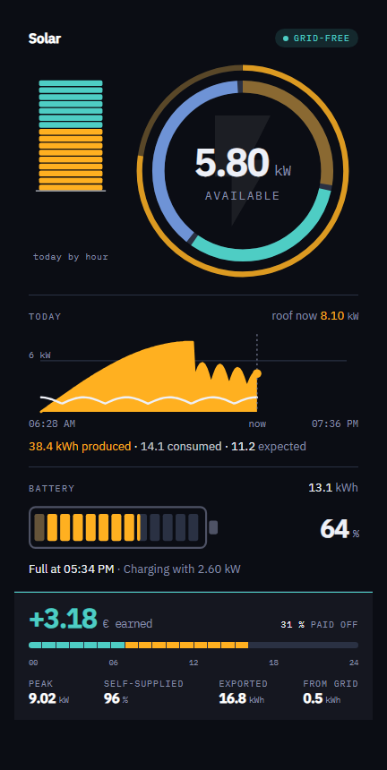
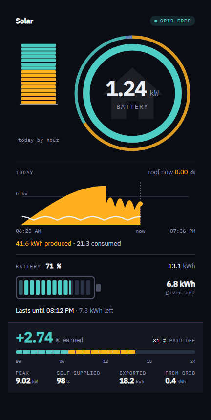
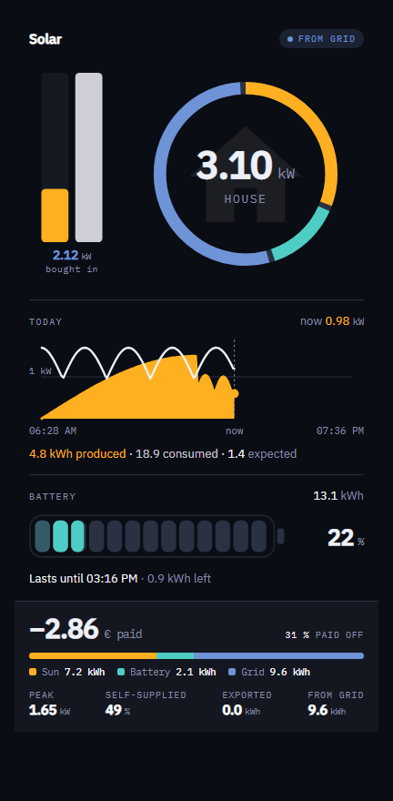
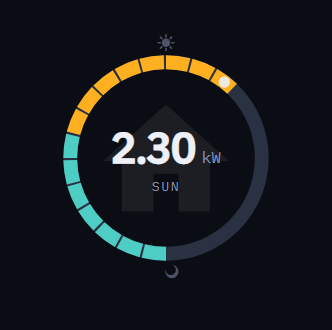
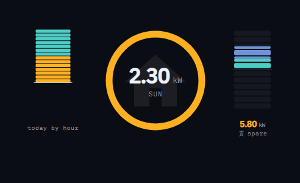
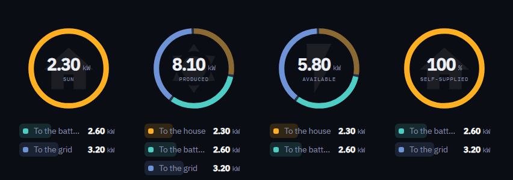
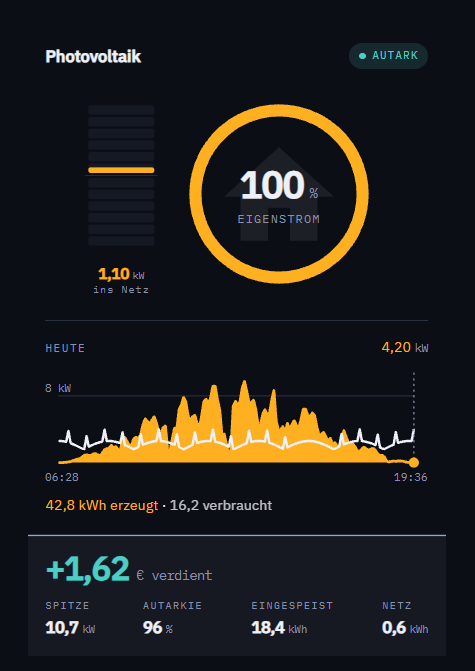

# Power Origin

**A Home Assistant card that answers one question first: where is the house's power coming from right now.**



The ring splits the house load into its sources. Sun gold, battery green, grid blue — the colour always names the participant that is not the house, everywhere on the card. Beside it a column with a middle: surplus climbs, grid draw sinks.

Three rules it is built on:

- **Nothing is invented for a missing sensor.** No entity, no block. An unreachable inverter says so instead of drawing a zero.
- **No figure appears twice.** The value list never repeats the ring's own centre.
- **A setting that cannot take effect is not shown.** The editor omits it rather than offering a dead control.

Only the house consumption sensor is required. Everything is configurable from the visual editor; **none of it needs YAML**.

---

## What it looks like

<p>
  
  
</p>

Left, an evening: the sun is down, the battery carries the house, and the card says how comfortably it reaches sunrise. Right, a grey day: two columns on one scale show the roof is short by two kilowatts, which is the one thing a ring cannot say.

<p>
  
  
</p>

Left, the clock: the whole circle is the day, noon at the top, sunrise on the left, a dot for now. Right, two columns at once — the day on one side of the ring, the moment on the other.



The four questions the ring can answer, side by side.



And a system without a battery: no battery block, no green anywhere. Nothing is invented for a sensor that is not there.

---

## Install

**HACS** — add this repository as a custom repository of type **Dashboard**, then install *Power Origin*. (Submitted to the default store; the pull request is in the queue.)

**By hand** — copy `power-origin-card.js` from the [latest release](https://github.com/hoizi89/power-origin-card/releases/latest) into `config/www/community/power-origin-card/` and add the resource `/local/community/power-origin-card/power-origin-card.js` as a **module**.

```yaml
type: custom:power-origin-card
entities:
  house: sensor.house_consumption
```

That is a working card. Every other entity switches on the part that needs it.

### Or let it read your Energy dashboard

Home Assistant already knows most of this. The editor has a button — **Take what the Energy dashboard knows** — that reads your energy preferences and fills in the PV power, the battery power, its state of charge and capacity, the grid power and both prices. Sixteen pickers become one, plus the house sensor.

It only ever fills fields that are still empty, so a choice you made is never overwritten. The daily counters are left alone on purpose: the Energy dashboard tracks lifetime totals and this card wants today, and reading one as the other would be wrong by years.

---

## The ring answers one of four questions

| Mode | The number in the middle | Answers |
| --- | --- | --- |
| `power` | house load | What is the house running on? |
| `production` | what the roof makes | What is the system doing? |
| `surplus` | spare power | Can I switch something on? |
| `autarky` | self-supplied share | How independent am I right now? |

`production` and `surplus` fall back to `power` before sunrise: a ring about production has nothing to say when nothing is produced.

## The ring and the column each have a type

| `ring.rings` | | `ring.meter_style` | |
| --- | --- | --- | --- |
| `single` | the shares right now | `blocks` | a stepped needle |
| `double` | a second ring outside, the same question over the whole day | `bar` | the same as one body |
| `clock` | the whole circle is the day, noon at the top | `day` | 24 bands, one per hour |
| | | `balance` | the roof against the house |

`day` and `balance` are the two that are never empty — a needle reads zero all night. **`balance` answers what no ring can**: a ring shows what a total is made of, never whether the total is enough. `ring.meter_second` puts a second column on the other side of the ring, so a day strip and a live needle can stand together.

---

## Where the money comes from

The card has no idea what you pay, so the money comes from sensors. There are two ways to give it to them.

**From an integration that tracks the tariff.** Point `cost_today`, `cost_export_today`, `cost_import_today` and `amortisation` at its sensors and the card just reads them. This is the way to do it **on a spot tariff**: the price moves through the day, so only something that accumulates as it goes can be right.

**From a fixed price.** On a fixed tariff you can skip three of those pickers. Give the card `price_import` and `price_export` — a number helper each — and it works the two sides out from the energy it already reads, and the balance out of those. Any sensor you do configure wins over the arithmetic, so you can mix the two.

Without either, the money line simply does not appear and everything else works unchanged.

### Integrations that pair well

| Integration | What it feeds |
| --- | --- |
| [PV Energy Management+](https://github.com/hoizi89/pv_management_fix) | Balance, export revenue, import cost and the paid-off percentage — every money figure this card can show, on a fixed or a spot tariff. |
| [Solcast PV Forecast](https://github.com/BJReplay/ha-solcast-solar) | `forecast` — how much the roof still expects today. |
| [Home Assistant's Energy dashboard](https://www.home-assistant.io/docs/energy/) | The daily energy totals, if your inverter integration does not already provide them. |

The card only asks for numbers and units, never for a particular brand: anything that exposes power in watts and daily energy in kilowatt hours will do. Developed against a **GoodWe** system.

---


---

## Tapping a figure

Any figure that comes from one entity opens that entity in Home Assistant's own more-info dialog, the way every other card does it: the ring-s centre figure, the battery percentage, the balance, the paid-off share, the reading beside the day heading, and the tiles for exported, imported, produced, used and expected.

Figures the card works out itself lead nowhere, and are not made to look as though they do. The peak and the self-supplied share have no entity behind them, so they stay plain text.

`tap_action` changes what a tap does — navigate somewhere, open a URL, call a service, or nothing at all — in Lovelace's own vocabulary.

---


---

## More

- **[Every option](docs/OPTIONS.md)** — the full reference: entities, settings, sign conventions, how the numbers are worked out, and the colour tokens you can override.
- **[Contributing](CONTRIBUTING.md)** — building, testing, releasing.

## Languages

English and German ship with the card, chosen from the Home Assistant user's language with English as the fallback. A test keeps the two tables in step, so a missing string fails the build rather than reaching a dashboard. Further languages are welcome — add a table to `src/localize.ts` and nothing else needs touching.

---


---

## Licence

MIT
